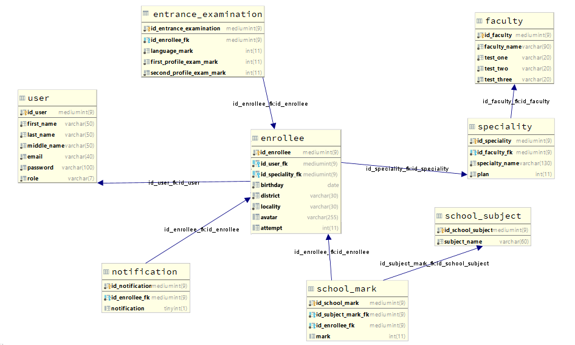

# ReceptionEnrolleeProject

__Final EPAM project__

**Theme**

Система Приемная комиссия. Абитуриент регистрируется на один 
из Факультетов с фиксированным планом набора, вводит баллы по 
соответствующим Предметам и аттестату. Результаты Администратором 
регистрируются в Ведомости. Система подсчитывает сумму баллов и 
определяет Абитуриентов, зачисленных в учебное заведение.

**Database shreme**

